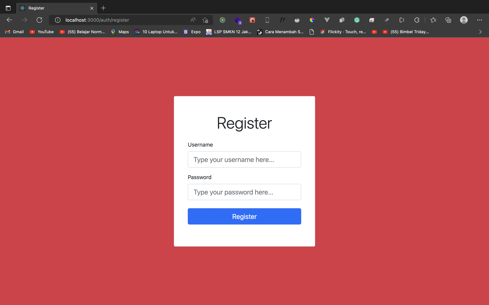
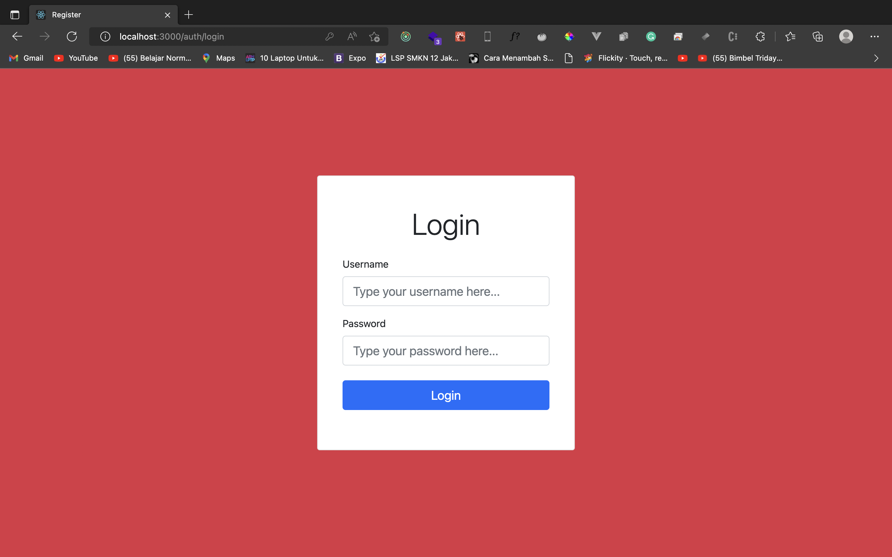
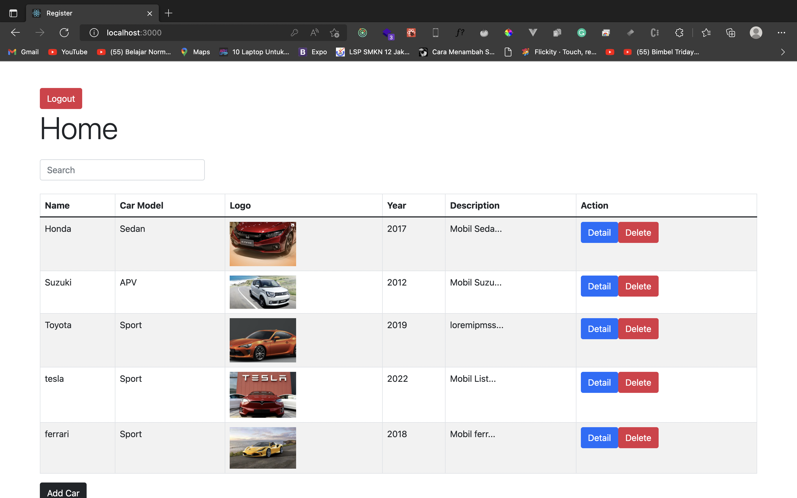
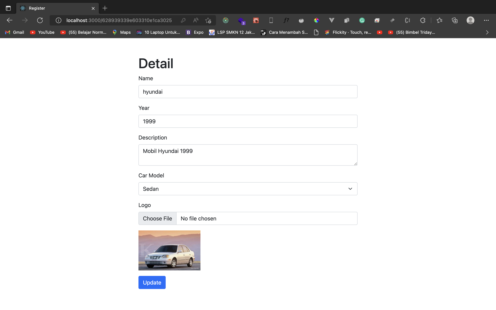

# Frontend Ucars
A Technical Test for Fullstack Developer Position in Ucars

## How To Run This App ?
- Make sure you had clone this repo
- Open your terminal in this project and type npx yarn install
- and then type npx yarn start

## Preview Project

### Register

### Login

### Home

### Detail
